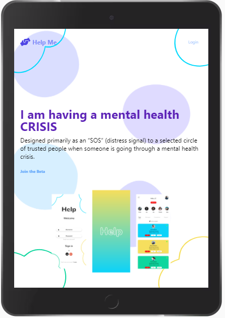

# Help Me

;

### Table of Contents
1. Purpose
2. Motivation
3. Technologies Used
4. Tips to run the program
5. License

### Purpose:
The app is called “Help Me” and is designed primarily as an “SOS” (distress signal) to a selected circle of trusted people when someone is going through a mental health crisis. The goal is for the user to build a trusted community around themselves with private conversations and provide a system to show the user's range of emotions.

### Motivation:

The ultimate motivation was to provide support to our friends and family who suffer from mental health issues. 

### This app was built with the following technologies:

**Angular:** A JavaScript framework for building single-page client applications using HTML and TypeScript.

**GitHub:** Web-based version control repository and Internet hosting service

**Adobe XD:** A wire-framing tool used to create a mockup/visual of what is to be coded

**JavaScript:** Object-oriented programming language for web pages

**HTML:** Mark-up language for creating web pages

**CSS:** A formatting language for styling web pages

**MongoDB:** A document (NoSQL) database that uses JSON-like documents with optional schemas

**DigitalOcean App Platform:** Platform-as-a-Service (PaaS) offering that allows developers to publish code directly to DigitalOcean servers without worrying about the underlying infrastructure.

### Tips to run the program
1. This project was generated with [Angular CLI](https://github.com/angular/angular-cli) version 11.0.4.
2. Run `ng serve` for a dev server. Navigate to `http://localhost:4200/`. The app will automatically reload if you change any of the source files.
3. Run `ng generate component component-name` to generate a new component. You can also use `ng generate directive|pipe|service|class|guard|interface|enum|module`.
4. These is crucial to building the app with Digital Ocean: 
* Build: npx ng build --prod
* Build: NODE_ENV=production npx ng build --prod

### License  
Commons Clause PUBLIC LICENSE
_Created by Miguel Hernandez and JC Smiley in June of 2020_

